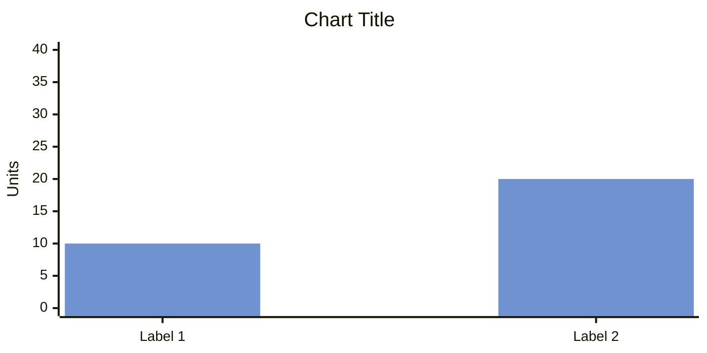
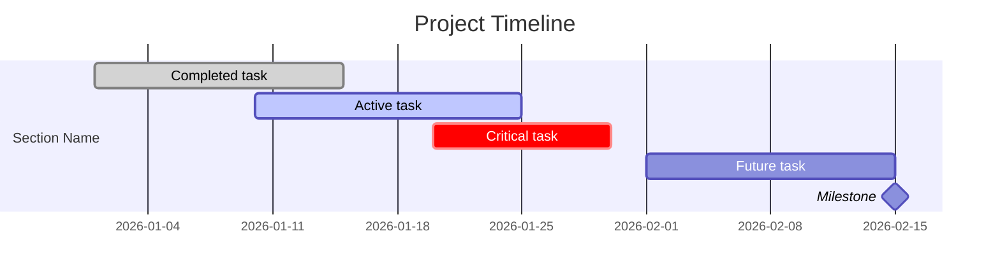

# Mermaid

Summary: Mermaid diagram and chart patterns for Markdown documents, status updates, and reports.

## Bar Charts with xychart-beta

Summary: Mermaid `xychart-beta` renders native bar charts in Typora, Obsidian, and many Mermaid-compatible renderers, but not GitHub.

Context: Markdown status updates sometimes need lightweight visual summaries without switching to spreadsheet-generated images.

Learning: Use `xychart-beta` for stakeholder-facing Markdown charts when the target renderer supports it. Do not rely on it for GitHub rendering yet. Use `#7092d0` as the standard medium blue-gray chart color for stakeholder-facing charts.

Template:

````markdown

````

Configurable:

- Width and height
- Background color
- Plot color palette, comma-separated for multiple series
- Title and axis label colors

Not configurable:

- Individual bar colors
- Bar stroke or border
- Axis line weight
- Grid styling
- Bar width or spacing
- Percentage-based dimensions

## Gantt Charts

Summary: Mermaid Gantt charts are mature and broadly supported across Typora, Obsidian, and GitHub.

Context: Gantt charts are useful for project updates, roadmap visualizations, status reports, and replacing manual spreadsheet timelines.

Learning: Use Mermaid Gantt charts for Markdown-native timelines when renderer compatibility matters. Group work into sections for phases, workstreams, or teams.

Template:

````markdown

````

Useful conventions:

- Task states: `done`, `active`, `crit`, `milestone`, or unmarked for default/future work.
- Duration formats: end date, duration such as `14d`, or `after taskId` dependencies.
- Sections: group tasks visually by workstream, phase, or team.
